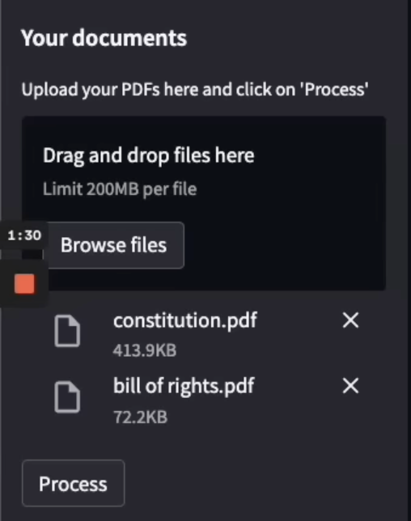
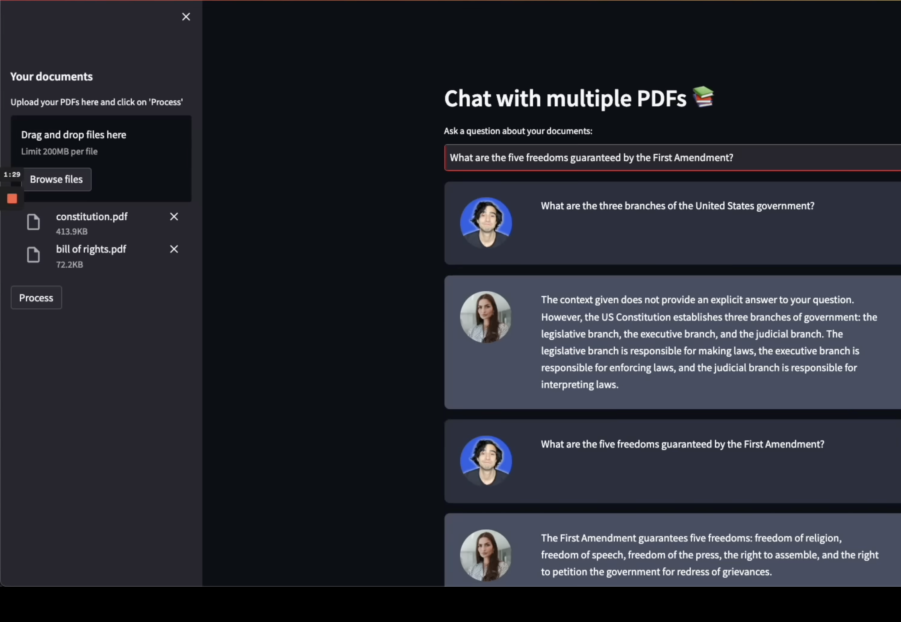

# Chat your PDFs 📚
------------
LangChain app to chat with PDFs. This Generative AI app allows you to upload multiple PDFs and it uses OpenAI's LLM to provide completions.

## Introduction
------------
This is a Python application designed for chatting with multiple PDF documents. You can ask questions about the PDFs using natural language, and the app will respond with relevant information extracted from the documents. This app employs an OpenAI large language model (LLM) to ensure accurate answers to your queries.

## How it works?
------------


The application operates through these steps to deliver responses to your questions:

1. `PDF Loading:` The app reads multiple PDF documents and extracts their textual content.
<p align="center">
  
</p>

2. `Text Chunking:` The extracted text undergoes segmentation into chunks for efficient processing.

3. `Language Model:` A language model is employed to create vector representations (embeddings) of these text chunks.

4. `Similarity Matching:` When a question is posed, the app compares it against the text chunks, identifying the most semantically similar ones.

5. `Response Generation:` The selected chunks are fed into the language model (along with the user question and chat history), which generates a response based on the pertinent content found within the PDFs.
<p align="center">
  
</p>

## Dependencies & Installation
------------
To set up the `Chat your PDFs` app, follow these steps:

1. Clone the repository to your local machine.

2. Install the necessary dependencies by executing the following command:
   ```
   pip install -r requirements.txt
   ```

3. Get an API key from OpenAI (or HuggingFace) and write it into the `.env` file in the project directory. 
```plaintext
OPENAI_API_KEY=your_secret_api_key
HUGGINGFACEHUB_API_TOKEN=your_api_token
```

## Usage
------------
To use the `Chat your PDFs` app, proceed with the following steps:

1. Confirm that you've installed the necessary dependencies and included the OpenAI API key (or HuggingFace token) in the `.env` file.

2. Execute the `app.py` file through the CLI. Use the following command:
   ```
   streamlit run app.py
   ```

3. The application will open in your default web browser, presenting the user interface.

4. Follow the provided instructions to load multiple PDF documents into the app.

5. Utilize the chat interface to ask questions in natural language about the loaded PDFs.

